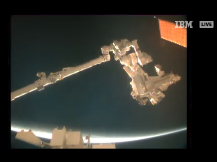
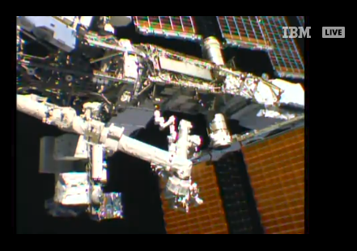

# MMM-ISS-Live

- Displays live video from the International Space Station.
- Audio from the ISS (when available).

Live video from the International Space Station includes internal views when the crew is on-duty and Earth views at other times. The video is accompanied by audio of conversations between the crew and Mission Control. This video is only available when the space station is in contact with the ground.

During "loss of signal" periods, viewers will see a blue screen. Since the station orbits the Earth once every 90 minutes, it experiences a sunrise or a sunset about every 45 minutes. When the station is in darkness, external camera video may appear black, but can sometimes provide spectacular views of lightning or city lights below.

## Examples

The module is a live stream. These are still shots, obviously.

 

## Installation

Go to the directory where the modules are stored and download this module by using `git clone`:

```bash
cd ~/MagicMirror/modules
git clone https://github.com/KristjanESPERANTO/MMM-ISS-Live
```

## Update

Go to the module’s directory and pull the latest version from GitHub:

```bash
cd ~/MagicMirror/modules/MMM-ISS-Live
git pull
```

## Configuration

### Easy example

```js
    {
      module: "MMM-ISS-Live",
      position: "bottom left"
    },
```

### Adapted example

```js
    {
      module: "MMM-ISS-Live",
      header: "ISS Live Sream",   // With header
      position: "bottom left",
      config: {
        url: "https://www.youtube.com/embed/xRPjKQtRXR8?si=zi-AnQaKiuwKkaLR", // Another video stream
        height: "540px",        // Double height than default
        width: "960px",         // Double width than default
        mute: false             // Sound enabled
      }
    },
```

There are several video streams from the ISS on YouTube. To switch to another stream, you need to set the URL option as in the customised example above.

- _LIVE: NASA Live Stream of Earth from Space (ISS)_
  `"https://www.youtube.com/embed/xRPjKQtRXR8?si=zi-AnQaKiuwKkaLR"`
- _Live High-Definition Views from the International Space Station (Official NASA Stream)_ - **Default**
  `"https://www.youtube.com/embed/P9C25Un7xaM?si=MVmSwml-ecTsw_Tr"`

**Side note:** _Basically you can use this module to embed any YouTube video. You only need to find out the empedded URL of the video and enter it as url option._

## Project status

Since the original module didn't work anymore and the author, [Mykle1](https://github.com/Mykle1), is no longer active, I forked the module. I fixed a few issues and will try to keep the module working in the future.

But **this module is in maintenance mode.** So I'm not planning any functional changes. If someone wants to take over the further development, I would be happy. PR's are welcome too!
