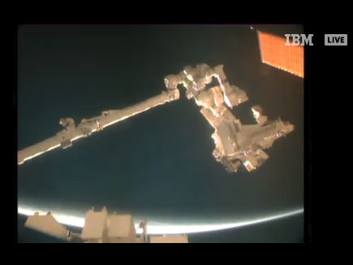
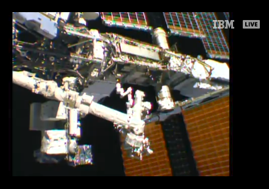

# MMM-ISS-Live

**MMM-ISS-Live** is module for [MagicMirror²](https://github.com/MagicMirrorOrg/MagicMirror) to display a live video stream from the International Space Station.

Live video from the International Space Station includes internal views when the crew is on-duty and Earth views at other times. The video is accompanied by audio of conversations between the crew and Mission Control. This video is only available when the space station is in contact with the ground.

During "loss of signal" periods, viewers will see a blue screen. Since the station orbits the Earth once every 90 minutes, it experiences a sunrise or a sunset about every 45 minutes. When the station is in darkness, external camera video may appear black, but can sometimes provide spectacular views of lightning or city lights below.

## Screenshots

 

## Installation

Go to the directory where the modules are stored and download this module by using `git clone`:

```bash
cd ~/MagicMirror/modules
git clone https://github.com/KristjanESPERANTO/MMM-ISS-Live
```

## Update

Go to the module’s directory and pull the latest version from GitHub:

```bash
cd ~/MagicMirror/modules/MMM-ISS-Live
git pull
```

## Configuration

### Easy example

```js
    {
      module: "MMM-ISS-Live",
      position: "bottom_left"
    },
```

### Adapted example

```js
    {
      module: "MMM-ISS-Live",
      header: "ISS Live Stream", // With header
      position: "bottom_left",
      config: {
        url: "https://www.youtube.com/embed/0FBiyFpV__g", // Another video stream
        height: "540px",         // Double height than default
        width: "960px",          // Double width than default
        mute: true               // Sound disabled
      }
    },
```

### Preparing Electron

MagicMirror² disables the `<webview>` tag by default. Enable it by adding the following snippet to your `config/config.js`:

```js
let config = {
  ...
  electronOptions: {
    webPreferences: {
      webviewTag: true;
    }
  },
  ...
}
```

If the tag stays disabled, the module automatically falls back to the iframe renderer.

### Docker / Browser notes

- The module adds an `origin` query parameter and sets `referrerpolicy="strict-origin-when-cross-origin"` on the iframe in browser/server mode. This helps prevent the YouTube "Video player configuration error (153)".
- If you still see player errors, check your browser dev tools for Content Security Policy (CSP) violations. Your server's CSP must allow connections to YouTube and Google Video domains, e.g.:
  - `frame-src`: `https://www.youtube.com` `https://www.youtube-nocookie.com`
  - `connect-src`/`media-src`: `https://*.youtube.com` `https://*.googlevideo.com`

  Configure this in your reverse proxy or MagicMirror server headers as appropriate.

### Other streams

There are several video streams from the ISS on YouTube. To switch to another stream, you need to set the URL option as in the customized example above.

- _24/7 Live from the International Space Station | Dream Trips_
  `"https://www.youtube.com/embed/0FBiyFpV__g"`
- _ISS Live Feed by NASA Goddard_ - **Default**
  `"https://www.youtube.com/embed/fO9e9jnhYK8"`
- _Live High-Definition Views from the International Space Station (Official NASA Stream)_
  `"https://www.youtube.com/embed/yf5cEJULZXk"` _(embedding may be disabled by video owner)_

**Side note:** _Basically you can use this module to embed any YouTube video (if the owner didn't disable embedding). You only need to find out the URL of the video and enter it as `url` option. Regular YouTube URLs (`youtube.com/watch?v=…` or `youtu.be/…`) are automatically converted to embed URLs._

## Troubleshooting

### WebGL / SwiftShader error on Raspberry Pi

On Raspberry Pi (and other devices without hardware GPU acceleration) you may see the following error in the MagicMirror log:

```text
Automatic fallback to software WebGL has been deprecated. Please use the --enable-unsafe-swiftshader flag to opt in to lower security guarantees for trusted content.
```

This is a Chromium GPU warning that tends to appear on Pi hardware regardless of configuration. As long as the video is playing fine, it is likely harmless noise. You can try adding `"enable-unsafe-swiftshader"` to `electronSwitches` in your `config/config.js`, but it may not make the message go away completely:

```js
let config = {
  // ...
  electronSwitches: ["enable-unsafe-swiftshader"]
  // ...
};
```

### Video shows "Playback on other websites has been disabled by the video owner"

The default stream URL may have had its embedding disabled by the video owner. Use the `url` option to point to a different stream (see [Other streams](#other-streams) above).

## Project status

Since the original module didn't work anymore and the author, [Mykle1](https://github.com/Mykle1), is no longer active, I forked the module. I fixed a few issues and will try to keep the module working in the future.

**This module is in maintenance mode.**

## Known issues

If you use pi-hole or any other ad blocker, you may need to whitelist some ad URLs to get the video stream working. Check out the browser console for the URL(s).

## Contributing

If you find any problems, bugs or have questions, please [open a GitHub issue](https://github.com/KristjanESPERANTO/MMM-ISS-Live/issues) in this repository.

Pull requests are of course also very welcome 🙂

### Code of Conduct

Please note that this project is released with a [Contributor Code of Conduct](CODE_OF_CONDUCT.md). By participating in this project you agree to abide by its terms.

### Developer commands

- `npm install` - Install development dependencies.
- `node --run demo` - Start MagicMirror with the demo configuration.
- `node --run lint` - Run linting and formatter checks.
- `node --run lint:fix` - Fix linting and formatter issues.
- `node --run test` - Run linting and formatter checks + Run spelling check.
- `node --run test:spelling` - Run spelling check.
